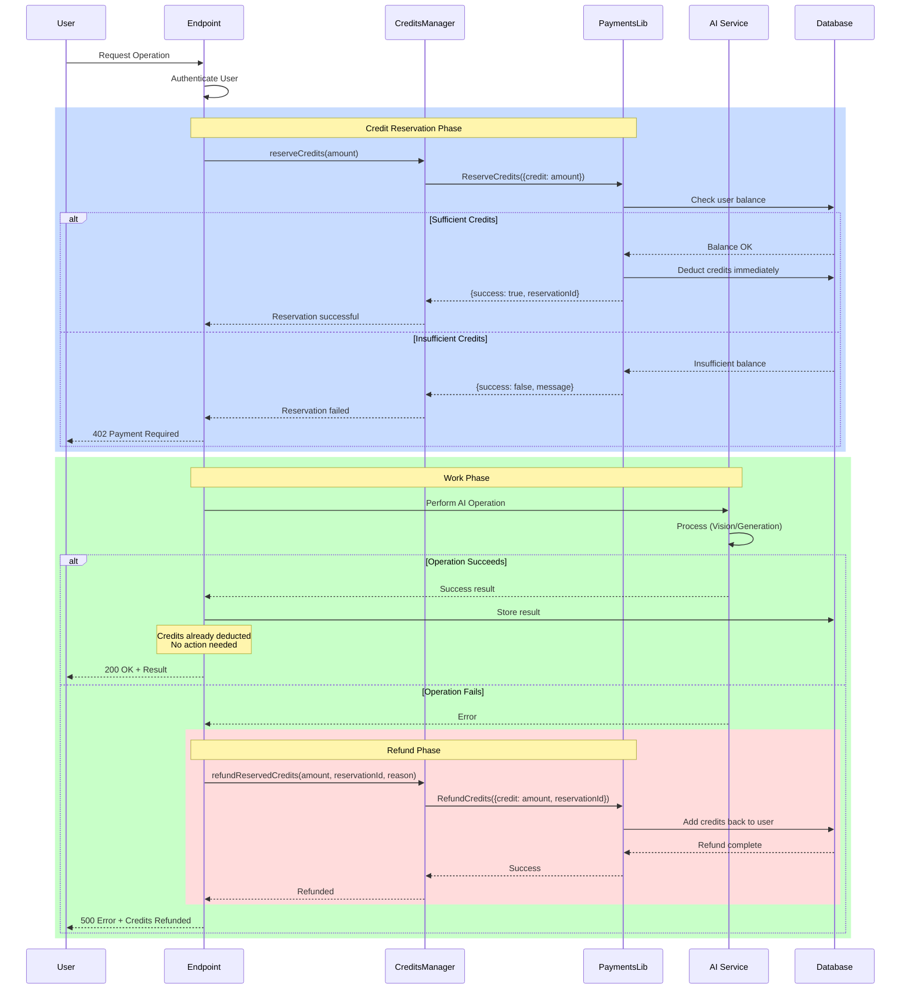
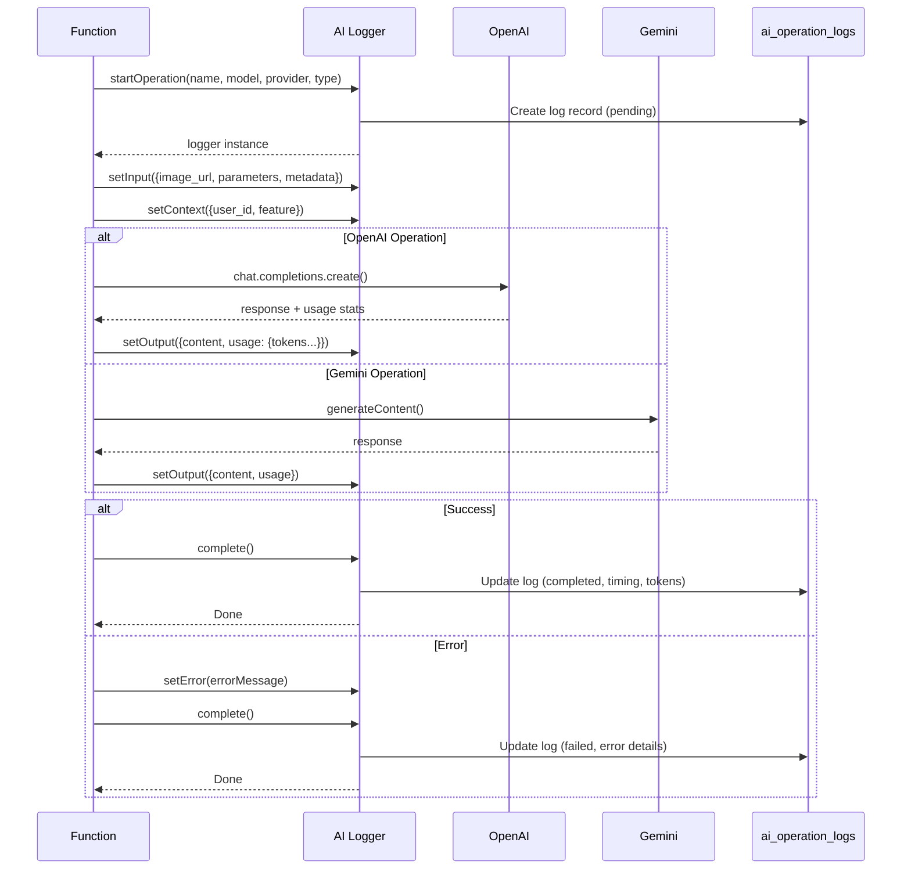
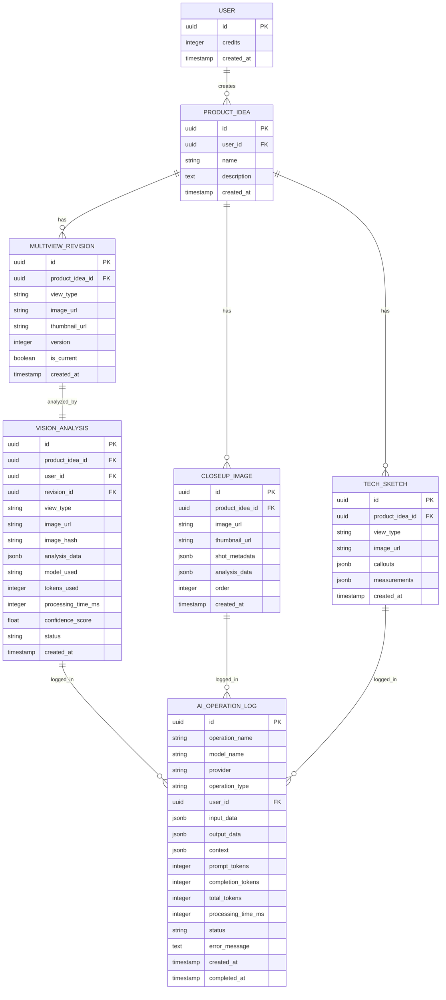

# Tech Pack V2 - End-to-End System Flow

## Complete Workflow Diagram

```mermaid
flowchart TD
    Start([User Uploads Product Image]) --> Upload[Upload to Supabase Storage]
    Upload --> CreateRevision[Create product_multiview_revisions record]

    CreateRevision --> CategoryDetect{Category Detection<br/>Optional}

    CategoryDetect -->|Auto-detect| CategoryAPI[POST /api/tech-pack-v2/category/detect]
    CategoryDetect -->|Skip| BaseViews

    CategoryAPI --> CategoryReserve[Reserve 0 Credits<br/>Free Operation]
    CategoryReserve --> CategoryAI[OpenAI GPT-4o Vision<br/>Detect Product Category]
    CategoryAI --> CategoryResult[Return: category, subcategory, confidence]
    CategoryResult --> BaseViews

    %% Base Views Analysis
    BaseViews[POST /api/tech-pack-v2/base-views/analyze] --> BaseViewsAuth{Authenticate User}
    BaseViewsAuth -->|✓ Valid| BaseViewsReserve[Reserve 3 Credits]
    BaseViewsAuth -->|✗ Invalid| Return401[401 Unauthorized]

    BaseViewsReserve -->|Success| BaseViewsValidate{Validate Input<br/>productId, revisionIds, category?}
    BaseViewsReserve -->|Insufficient| Return402[402 Payment Required]

    BaseViewsValidate -->|✓ Valid| FetchRevisions[Fetch Revisions from DB<br/>product_multiview_revisions]
    BaseViewsValidate -->|✗ Invalid| RefundBase1[Refund 3 Credits] --> Return400Base[400 Bad Request]

    FetchRevisions -->|Found| CheckCache{Check Cache<br/>revision_vision_analysis<br/>by image_hash}
    FetchRevisions -->|Not Found| RefundBase2[Refund 3 Credits] --> Return404[404 Not Found]

    CheckCache -->|Cache Hit| ReturnCached[Return Cached Analysis<br/>0 tokens used]
    CheckCache -->|Cache Miss| BaseViewsAI

    BaseViewsAI[OpenAI GPT-4o Vision<br/>UNIVERSAL_BASE_VIEW_PROMPT] --> BaseViewsAnalyze[Analyze Each View:<br/>- Materials<br/>- Dimensions<br/>- Colors<br/>- Construction<br/>- Design Elements]

    BaseViewsAnalyze --> BaseViewsConfidence[Assess Confidence Score<br/>confidence-scorer.ts]
    BaseViewsConfidence --> BaseViewsStore[Store in revision_vision_analysis<br/>with image_hash for caching]
    BaseViewsStore --> BaseViewsLog[AI Logger: Complete<br/>Track tokens, timing]
    BaseViewsLog --> ReturnBase[Return: analyses array<br/>Credits: 3 used]

    ReturnCached --> CloseUps
    ReturnBase --> CloseUps

    %% Close-Ups Generation
    CloseUps[POST /api/tech-pack-v2/close-ups/generate] --> CloseUpsAuth{Authenticate User}
    CloseUpsAuth -->|✓ Valid| CloseUpsReserve[Reserve 3 Credits]
    CloseUpsAuth -->|✗ Invalid| Return401Close[401 Unauthorized]

    CloseUpsReserve -->|Success| CloseUpsValidate{Validate Input<br/>productId, baseViewAnalyses, category}
    CloseUpsReserve -->|Insufficient| Return402Close[402 Payment Required]

    CloseUpsValidate -->|✓ Valid| CloseUpsPlan[AI: Generate Close-Up Plan<br/>Identify key details to capture]
    CloseUpsValidate -->|✗ Invalid| RefundClose1[Refund 3 Credits] --> Return400Close[400 Bad Request]

    CloseUpsPlan --> CloseUpsGenerate[Gemini 2.5 Flash Image Preview<br/>Generate 6-10 Detail Shots]
    CloseUpsGenerate --> CloseUpsUpload[Upload to Supabase Storage<br/>product-closeups/]
    CloseUpsUpload --> CloseUpsAnalyze[OpenAI Vision: Analyze Each Close-Up<br/>Extract technical details]
    CloseUpsAnalyze --> CloseUpsStore[Store in product_closeup_images]
    CloseUpsStore --> CloseUpsLog[AI Logger: Complete]
    CloseUpsLog --> ReturnClose[Return: generatedImages array<br/>Credits: 3 used]

    ReturnClose --> Sketches

    %% Technical Sketches
    Sketches[POST /api/tech-pack-v2/sketches/generate] --> SketchesAuth{Authenticate User}
    SketchesAuth -->|✓ Valid| SketchesReserve[Reserve 3 Credits]
    SketchesAuth -->|✗ Invalid| Return401Sketch[401 Unauthorized]

    SketchesReserve -->|Success| SketchesValidate{Validate Input<br/>productId, productAnalysis, category}
    SketchesReserve -->|Insufficient| Return402Sketch[402 Payment Required]

    SketchesValidate -->|✓ Valid| SketchesViews[Generate 3 Technical Sketches<br/>Front, Back, Side]
    SketchesValidate -->|✗ Invalid| RefundSketch1[Refund 3 Credits] --> Return400Sketch[400 Bad Request]

    SketchesViews --> SketchLoop{For Each View}

    SketchLoop --> SketchPrompt[AI: Generate Technical Sketch Prompt<br/>Based on analysis data]
    SketchPrompt --> SketchGen[Gemini 2.5 Flash: Generate Line Drawing<br/>With callouts and measurements]
    SketchGen --> SketchUpload[Upload to Supabase Storage<br/>product-sketches/]
    SketchUpload --> SketchAnalyze[AI: Extract Callout Data<br/>Measurements, annotations]
    SketchAnalyze --> SketchStore[Store in product_tech_sketches]
    SketchStore --> SketchLoop

    SketchLoop -->|All Done| SketchesLog[AI Logger: Complete]
    SketchesLog --> ReturnSketch[Return: sketches array with callouts<br/>Credits: 3 used]

    ReturnSketch --> Optional

    %% Optional Operations
    Optional[Optional Operations]

    Optional --> Edit[POST /api/tech-pack-v2/edit<br/>Edit Single Field]
    Optional --> Regenerate[POST /api/tech-pack-v2/regenerate<br/>Regenerate Single View]

    Edit --> EditAuth{Authenticate User}
    EditAuth -->|✓ Valid| EditReserve[Reserve 1 Credit]
    EditAuth -->|✗ Invalid| Return401Edit[401 Unauthorized]

    EditReserve -->|Success| EditValidate{Validate Input<br/>revisionId, fieldPath, editPrompt}
    EditReserve -->|Insufficient| Return402Edit[402 Payment Required]

    EditValidate -->|✓ Valid| EditFetch[Fetch Current Analysis<br/>revision_vision_analysis]
    EditValidate -->|✗ Invalid| RefundEdit1[Refund 1 Credit] --> Return400Edit[400 Bad Request]

    EditFetch --> EditAI[OpenAI Vision: AI-Assisted Edit<br/>Update specific field]
    EditAI --> EditUpdate[Update revision_vision_analysis]
    EditUpdate --> EditLog[AI Logger: Complete]
    EditLog --> ReturnEdit[Return: updated field<br/>Credits: 1 used]

    Regenerate --> RegenAuth{Authenticate User}
    RegenAuth -->|✓ Valid| RegenReserve[Reserve 1 Credit]
    RegenAuth -->|✗ Invalid| Return401Regen[401 Unauthorized]

    RegenReserve -->|Success| RegenValidate{Validate Input<br/>revisionId, regeneratePrompt?}
    RegenReserve -->|Insufficient| Return402Regen[402 Payment Required]

    RegenValidate -->|✓ Valid| RegenFetch[Fetch Original Analysis]
    RegenValidate -->|✗ Invalid| RefundRegen1[Refund 1 Credit] --> Return400Regen[400 Bad Request]

    RegenFetch --> RegenGen[Gemini: Regenerate Image<br/>Based on analysis + prompt]
    RegenGen --> RegenUpload[Upload New Version<br/>Create new revision or replace]
    RegenUpload --> RegenAnalyze[Re-analyze with OpenAI Vision]
    RegenAnalyze --> RegenStore[Store New Analysis]
    RegenStore --> RegenLog[AI Logger: Complete]
    RegenLog --> ReturnRegen[Return: new revision data<br/>Credits: 1 used]

    ReturnEdit --> Complete
    ReturnRegen --> Complete
    ReturnSketch --> Complete

    Complete([Tech Pack Complete<br/>Total Credits: 9-10])

    style Start fill:#e1f5e1
    style Complete fill:#e1f5e1
    style CategoryAPI fill:#fff4e6
    style BaseViews fill:#e3f2fd
    style CloseUps fill:#f3e5f5
    style Sketches fill:#fce4ec
    style Edit fill:#fff3e0
    style Regenerate fill:#e0f2f1
    style Return401 fill:#ffebee
    style Return402 fill:#fff3e0
    style Return404 fill:#ffebee
    style Return400Base fill:#ffebee
    style Return401Close fill:#ffebee
    style Return402Close fill:#fff3e0
    style Return400Close fill:#ffebee
    style Return401Sketch fill:#ffebee
    style Return402Sketch fill:#fff3e0
    style Return400Sketch fill:#ffebee
    style Return401Edit fill:#ffebee
    style Return402Edit fill:#fff3e0
    style Return400Edit fill:#ffebee
    style Return401Regen fill:#ffebee
    style Return402Regen fill:#fff3e0
    style Return400Regen fill:#ffebee
```

## Credit Management Flow

## AI Operation Flow (with Logging)

## Database Schema Flow

## Key Features

### 1. Universal Product Analysis
- **No Category Limitations**: Analyzes ANY product type (20+ domains + "any other product")
- **Dynamic Field Generation**: AI adapts fields based on product (not hardcoded schemas)
- **Industry-Specific Terminology**: Uses correct terms for each product category

### 2. Credit Management
- **Reserve → Work → Refund Pattern**: Credits reserved upfront, refunded on failure
- **Prevents Credit Loss**: Users never lose credits for failed operations
- **Transparent Pricing**:
  - Category Detection: FREE
  - Base Views Analysis: 3 credits (5 views)
  - Close-Ups Generation: 3 credits (6-10 shots)
  - Technical Sketches: 3 credits (3 sketches)
  - AI Edit: 1 credit per edit
  - Regenerate View: 1 credit per regeneration
  - **Total for Complete Tech Pack: 9 credits**

### 3. Caching System
- **Image Hash-Based**: Same image = instant cached result (0 tokens)
- **Stored in DB**: revision_vision_analysis table
- **Fast Retrieval**: Sub-second response for cached analyses

### 4. AI Operation Logging
- **Complete Audit Trail**: Every AI call logged in ai_operation_logs
- **Performance Metrics**: Tokens used, processing time, costs
- **Error Tracking**: Failed operations with detailed error messages
- **Usage Analytics**: Track which features are most used

### 5. Progressive Generation
- **Step-by-Step**: Generate base views → close-ups → sketches → refine
- **Modular**: Each step is independent, can regenerate/edit individually
- **Data Flow**: Each step uses output from previous steps

### 6. Multi-AI Integration
- **OpenAI GPT-4o Vision**: Analysis, detection, editing (high accuracy)
- **Gemini 2.5 Flash**: Image generation (fast, cost-effective)
- **Best Tool for Job**: Uses optimal AI for each task

## Error Handling

### All Endpoints Follow Same Pattern:
1. **Authentication Check** → 401 if failed
2. **Credit Reservation** → 402 if insufficient
3. **Input Validation** → 400 if invalid (with refund)
4. **Data Fetch** → 404 if not found (with refund)
5. **AI Operation** → 500 if failed (with refund)
6. **Success** → 200 with result (credits kept)

### Automatic Refunds On:
- Invalid input data
- Database errors
- AI service failures
- Network timeouts
- Any unexpected errors

## Performance Optimizations

1. **Caching**: Avoid duplicate AI calls for same images
2. **Batch Processing**: Analyze multiple views in parallel where possible
3. **Singleton OpenAI Client**: Reuse connection across requests
4. **Efficient Prompts**: Optimized token usage in system prompts
5. **Streaming**: Large responses streamed where applicable
6. **Background Jobs**: Heavy processing can be queued

## Security

1. **Server-Side Only**: All AI operations use "use server" directive
2. **Authentication Required**: Every endpoint checks user authentication
3. **Input Validation**: Zod schemas validate all inputs
4. **SQL Injection Prevention**: Parameterized queries via Supabase
5. **Rate Limiting**: Credit system naturally rate-limits usage
6. **Error Sanitization**: User-friendly errors, detailed logs for debugging

## Monitoring

1. **AI Logger**: Tracks all operations in database
2. **Console Logging**: Detailed logs for debugging
3. **Credit Tracking**: Every reservation/refund logged
4. **Performance Metrics**: Processing time, token usage tracked
5. **Error Reporting**: All errors logged with context

---

**Total System Capacity**: Unlimited product types, scalable architecture, production-ready
