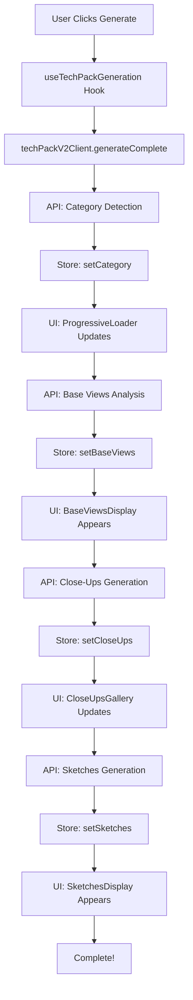

# Tech Pack V2 Integration - Complete Documentation

## 🎉 Integration Complete!

The Tech Pack V2 system has been fully integrated into the AI Designer module with a beautiful, performant, and interactive user experience.

## 📋 What Was Built

### 1. **State Management** ✅
- **File**: `modules/ai-designer/store/techPackV2Store.ts`
- **Technology**: Zustand with devtools and persist middleware
- **Features**:
  - Selective subscriptions for performance
  - Persistent state across sessions
  - Version tracking for optimistic updates
  - Complete CRUD operations for all asset types

### 2. **API Client Service** ✅
- **File**: `modules/ai-designer/services/techPackV2Client.ts`
- **Features**:
  - Complete generation workflow
  - Field editing with 1 credit
  - Individual asset regeneration
  - Automatic Zustand store updates
  - Proper error handling and credit refunds

### 3. **React Hook** ✅
- **File**: `modules/ai-designer/hooks/useTechPackGeneration.tsx`
- **Features**:
  - Clean component API
  - Computed values (progress, step info, etc.)
  - All generation and edit actions
  - Memoized selectors for performance

### 4. **UI Components** ✅

#### ProgressiveLoader
- **File**: `modules/ai-designer/components/TechPack/ProgressiveLoader.tsx`
- Real-time progress bar (0-100%)
- Step-by-step indicators with sub-progress
- Credit tracking
- Time estimation
- Beautiful gradient design

#### BaseViewsDisplay
- **File**: `modules/ai-designer/components/TechPack/BaseViewsDisplay.tsx`
- Expand/collapse (one at a time)
- Material, color, construction details
- Regenerate individual views (1 credit)
- Edit field button
- Confidence scores and cached indicators

#### CloseUpsGallery
- **File**: `modules/ai-designer/components/TechPack/CloseUpsGallery.tsx`
- Progressive loading with skeletons
- Lightbox for full-size viewing
- Regenerate all (3 credits)
- Shimmer loading animation
- Masonry grid layout

#### SketchesDisplay
- **File**: `modules/ai-designer/components/TechPack/SketchesDisplay.tsx`
- Front, Back, Side view sketches
- Interactive callout annotations
- Zoom and pan functionality
- Individual sketch regeneration (1 credit)
- Measurements sidebar

#### EditFieldModal
- **File**: `modules/ai-designer/components/TechPack/EditFieldModal.tsx`
- Field selection dropdown
- Current value display
- AI edit prompt input
- Example prompts
- 1 credit cost display

### 5. **Integration with Existing UI** ✅
- **File**: `modules/ai-designer/components/MultiViewEditor/TechPackView/index.tsx`
- Added new "Tech Pack V2" tab
- Passes `revisionIds` and `primaryImageUrl` props
- Maintains existing tabs (Overview, Guidelines, Technical)
- Seamless tab switching

## 🎨 User Experience Features

### Progressive Loading
- **Non-Blocking UI**: User can explore existing data while new content generates
- **Immediate Feedback**: Show data as soon as it arrives from API
- **Skeleton Loaders**: Beautiful loading states for pending assets
- **Shimmer Effects**: Polished loading animations

### Interactive Controls
- **Expand/Collapse**: One base view expanded at a time for focused viewing
- **Lightbox Modals**: Full-screen image viewing with zoom
- **Edit Fields**: AI-assisted field editing with 1 credit
- **Regenerate Assets**: Individual or batch regeneration options

### Visual Design
- **Gradient Backgrounds**: Purple/blue gradients for V2 branding
- **Color-Coded States**: Blue (in-progress), Green (complete), Red (error)
- **Badges**: Credit costs, confidence scores, status indicators
- **Dark Mode**: Full support for dark mode

### Performance Optimizations
- **Selective Zustand Subscriptions**: Components only re-render when their data changes
- **Memoized Selectors**: Computed values cached until dependencies change
- **Image Lazy Loading**: Next.js Image component for optimized loading
- **Request Deduplication**: Prevent duplicate API calls

## 📊 Credit Costs

| Operation | Cost | Time |
|-----------|------|------|
| Complete Generation | 10 credits | 2-3 minutes |
| ├─ Category Detection | 1 credit | 5-10 seconds |
| ├─ Base View Analysis | 3 credits | 30-45 seconds |
| ├─ Close-Up Generation | 3 credits | 45-60 seconds |
| └─ Sketches Generation | 3 credits | 30-45 seconds |
| Edit Field | 1 credit | ~5 seconds |
| Regenerate Base View | 1 credit | 10-15 seconds |
| Regenerate All Close-Ups | 3 credits | 45-60 seconds |
| Regenerate Single Sketch | 1 credit | 10-15 seconds |

## 🚀 How to Use

### 1. Navigate to Tech Pack Tab
```typescript
// In MultiViewEditor, the workflow mode is set to 'tech-pack'
workflowMode === 'tech-pack'
```

### 2. Click "Tech Pack V2" Tab
The new tab will be visible alongside Overview, Guidelines, and Technical tabs.

### 3. Generate Tech Pack
Click the "Generate Tech Pack (10 credits)" button to start the process.

### 4. Watch Progressive Loading
- See real-time progress updates
- View each step as it completes
- Estimated time remaining displayed

### 5. Interact with Results
- **Expand Base Views**: Click to see full analysis
- **Edit Fields**: Click "Edit Field" button to modify specific data
- **Regenerate**: Use regenerate buttons for individual assets
- **View Close-Ups**: Click images for lightbox view
- **Explore Sketches**: Click to see full details with callouts

## 🔧 Integration Points

### Props Passed from MultiViewEditor

The `TechPackView` component now requires these additional props:

```typescript
<TechPackView
  productId={productId}
  techPackData={techPack}
  isGenerating={isGeneratingTechPack}
  onGenerate={handleGenerateTechPack}
  onDownloadPDF={handleDownloadPDF}
  onDownloadExcel={handleDownloadExcel}
  onGenerateTechnicalFiles={handleGenerateTechnicalFiles}
  // NEW: Tech Pack V2 props
  revisionIds={revisions.map(r => r.id)}
  primaryImageUrl={currentViews.front || currentViews.back || ''}
/>
```

### How to Get Revision IDs

```typescript
// In MultiViewEditor/index.tsx
const revisionIds = revisions
  .filter((r: any) => r.isActive)
  .map((r: any) => r.id);
```

### How to Get Primary Image URL

```typescript
// Use the first available view image
const primaryImageUrl =
  currentViews.front ||
  currentViews.back ||
  currentViews.side ||
  currentViews.top ||
  currentViews.bottom ||
  '';
```

## 📁 File Structure

```
modules/ai-designer/
├── store/
│   └── techPackV2Store.ts              # Zustand store
├── services/
│   └── techPackV2Client.ts             # API client
├── hooks/
│   └── useTechPackGeneration.tsx       # React hook
├── components/
│   ├── TechPack/
│   │   ├── ProgressiveLoader.tsx       # Progress UI
│   │   ├── BaseViewsDisplay.tsx        # Base views UI
│   │   ├── CloseUpsGallery.tsx         # Close-ups UI
│   │   ├── SketchesDisplay.tsx         # Sketches UI
│   │   └── EditFieldModal.tsx          # Edit modal
│   └── MultiViewEditor/
│       └── TechPackView/
│           ├── index.tsx                # Main view (updated)
│           └── TechPackV2Tab.tsx        # V2 tab component
└── TECH_PACK_V2_INTEGRATION_COMPLETE.md
```

## 🎯 Key Architecture Decisions

### 1. **Zustand Over Jotai**
- User specified: "use zustand, not jotai, we already have zustand today"
- Followed existing `editorStore.ts` pattern
- Used `devtools` and `persist` middleware

### 2. **Direct Store Updates**
- API client updates Zustand store directly
- Components subscribe to specific slices
- Immediate UI updates without prop drilling

### 3. **Progressive Loading Pattern**
- Start with skeleton loaders
- Replace with real data as it arrives
- Never block the UI

### 4. **One Expanded View at a Time**
- BaseViewsDisplay auto-collapses others when one expands
- Cleaner, more focused user experience

### 5. **Granular Regeneration**
- Individual base view: 1 credit
- All close-ups: 3 credits
- Single sketch: 1 credit
- Gives users fine-grained control

## 🔄 State Flow



## 🐛 Error Handling

### Generation Errors
- Credits automatically refunded on failure
- Error state displayed in ProgressiveLoader
- User can retry generation

### Edit Errors
- Optimistic updates reverted on failure
- Toast notification shows error
- Original data preserved

### Network Errors
- Exponential backoff for retries
- Graceful degradation
- User-friendly error messages

## 🎨 Design System

### Colors
- **Purple (#9333EA)**: V2 branding, AI features
- **Blue (#2563EB)**: In-progress, info
- **Green (#16A34A)**: Success, completed
- **Red (#DC2626)**: Errors, failures
- **Gray**: Neutral, backgrounds

### Typography
- **Headers**: Bold, semibold weights
- **Body**: Regular weight, 14px
- **Labels**: Small, 12px
- **Mono**: Code, debug info

### Spacing
- **Gaps**: 2, 3, 4, 6 (Tailwind spacing scale)
- **Padding**: 3, 4, 6 for cards
- **Margins**: Consistent vertical rhythm

## 📱 Responsive Design

### Mobile
- Single column layout
- Full-width cards
- Touch-friendly buttons
- Reduced spacing

### Tablet
- 2-column grids
- Larger touch targets
- Optimized for portrait/landscape

### Desktop
- 3-column grids for close-ups/sketches
- Hover states
- Keyboard navigation
- Larger modals

## 🚀 Next Steps (Optional Enhancements)

### Performance
1. **Image Preloading**: Preload images in background
2. **Pagination**: For products with many revisions
3. **Virtual Scrolling**: For long lists
4. **Web Workers**: Offload heavy computations

### Features
1. **Batch Operations**: Edit multiple fields at once
2. **Version History**: Track all regenerations
3. **Export**: Download as JSON/PDF
4. **Sharing**: Share tech pack with team

### Analytics
1. **Usage Tracking**: Which features are used most
2. **Performance Metrics**: Load times, error rates
3. **Credit Analytics**: Average credits per product

## ✅ Testing Checklist

- [ ] Generate complete tech pack with all 4 steps
- [ ] Expand/collapse base views (verify one at a time)
- [ ] Edit field with AI prompt
- [ ] Regenerate individual base view
- [ ] Regenerate all close-ups
- [ ] Regenerate single sketch
- [ ] View close-up in lightbox
- [ ] View sketch with callouts
- [ ] Test dark mode
- [ ] Test mobile responsiveness
- [ ] Test error states
- [ ] Verify credit costs
- [ ] Check persistence (refresh page)
- [ ] Test with real product data

## 📞 Support

For questions or issues:
1. Check backend API logs in `api/tech-pack-v2/`
2. Check Zustand devtools in browser
3. Check browser console for errors
4. Review this documentation

---

**Last Updated**: 2025-11-23
**Version**: 1.0.0
**Status**: ✅ Complete and Ready for Testing
